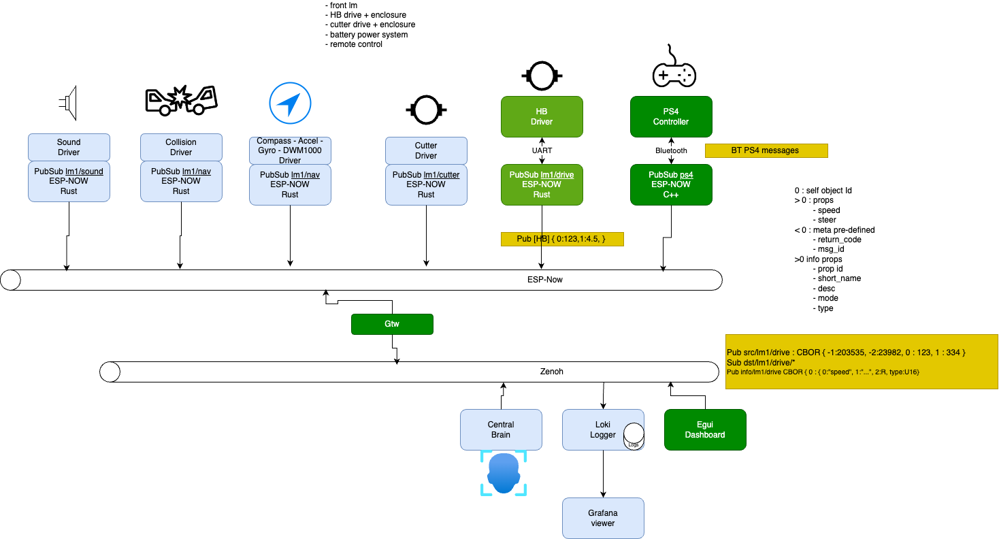

# Lawn-mower robotics - Zenoh integration of micro-services

# Features
- The robot is composed of micro-services which communicate on a local bus via pub/sub
- The local bus can be a I2C,serial,USB or ESP-NOW
- the protocol supports device discovery
- every device has a unique id of 32 bits by doing a FNV hash on the name , example : FNV("lm1/drive")
- every device has properties which have a sequential id : 0... N
- the device will broadcast or answer queries on the specifics of a property
- with ESP-NOW there is no central broker , the broadcast is sufficient for now to support the subscribe and publish features. 
- target is to use esp-now as another peer-to-peer protocol 
- a bridge will provide a gateway to the rest of the network to support dashboards, logging and a central brain
- The services themselves will be a composition of actors 
- The actors will response to ActorCmd and generate ActorEvent 
- ActorEvent will be handled by non-blocking services
- Each Actor should be independent and not aware of others
- The inter-actor glue is provided in the main code

# An evaluation project of Zenoh 

## Features
Zenoh is feature rich and would permit my own design to be much more efficient
- datat routing based
- timestamping
- discovery
- query
- speed
- optimized protocol

Looks good on paper, letś go.

## Observations
- Memory size of executable is comparable to Redis ( which is my alternative )
- Should support shared memory

## Regrets
### Serial doesn´t work or is not fully implemented yet.
See zenoh-serial README.MD
Zenoh is missing a lot in the serial implementation :
- zenohd doesn´t recover from a closed session on the serial port and never reads again
- when zenohd receives an InitSyn after the session starts, it creates an error and doesn´t go back in the state of a new session. It simply doesn´t expect an InitSyn and doesn´t handle it correctly.
- the espidf client I tried is incomplete and doesn´t do a retransmission retry. 
- some smaller bugs see : https://github.com/eclipse-zenoh/roadmap/discussions/120
- blocking threads in esp , kicks the watchdog timer

## So putting zenoh discovery on hold, awaiting forum feedback or issue reporting on github. 
Which is a pity because I like enormously the concepts behind this work. 

## BTW : I noticed that also programs like z_sub don´t detect that zenohd was gone. 

### Redis implementation stack
- redis server
- web socket proxy
- serial proxy 
- udp proxy
### Zenoh stack
- zenohd
- storage plugin for static data
- serial proxy

