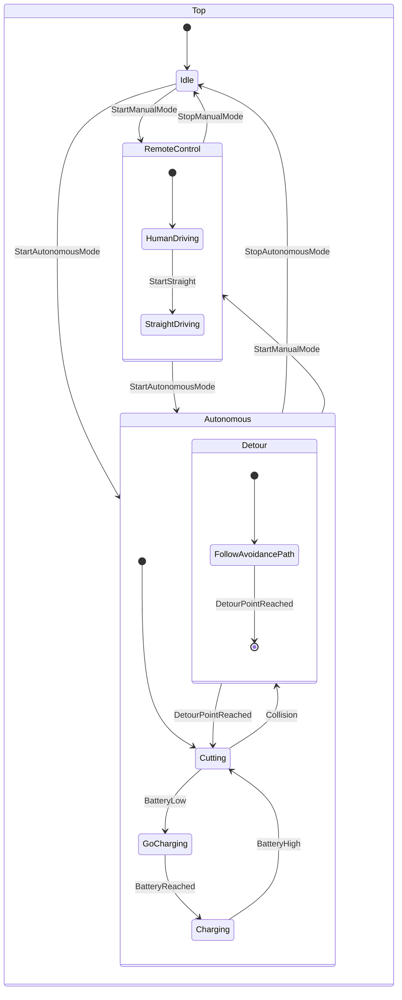

```mermaid
stateDiagram-v2
    State Top {
        [*] --> Idle
        Idle --> RemoteControl : StartManualMode
        Idle --> Autonomous : StartAutonomousMode
        RemoteControl --> Idle : StopManualMode
        RemoteControl --> Autonomous : StartAutonomousMode
        Autonomous --> Idle : StopAutonomousMode
        Autonomous --> RemoteControl : StartManualMode
        }

    State Detour {
        [*] --> FollowAvoidancePath
        FollowAvoidancePath --> [*] : DetourPointReached
    }

    State RemoteControl {
        [*] --> HumanDriving
        HumanDriving --> StraightDriving : StartStraight
    }

    State Autonomous {
        [*] --> Cutting
        Cutting --> GoCharging : BatteryLow
        GoCharging --> Charging : BatteryReached
        Charging --> Cutting : BatteryHigh
        Cutting --> Detour : Collision
        Detour --> Cutting : DetourPointReached
    }
```