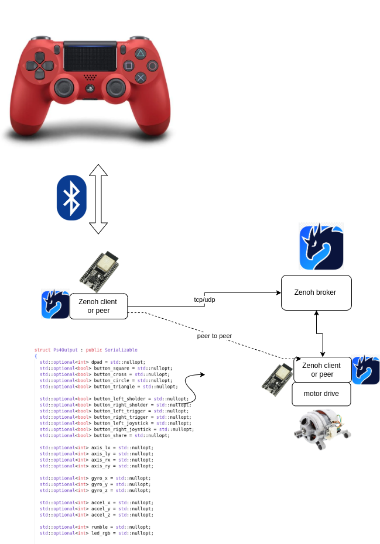

# A PS4 controller to drive your next robotics application



## Purpose
This integration provides a low-cost solution to drive or control remotely a robot. As I needed something for my own private project.
The interpretation of the data is up to the application itself. 
The PS4 controller sends about 25 msg/sec via Zenoh. 
The data is serialized in a CBOR Array 
No filtering is applied yet. 
The same message can be send to the controller for invoking rumble or activate leds. ( TBD ) 

## How to connect with PS4 bluetooth controller

[](https://www.youtube.com/watch?v=URw88NguXek)

## Data layout 
```C++
struct Ps4Output : public Serializable
{
  std::optional<bool> button_left = std::nullopt;
  std::optional<bool> button_right = std::nullopt;
  std::optional<bool> button_up = std::nullopt;
  std::optional<bool> button_down = std::nullopt;
  
  std::optional<bool> button_square = std::nullopt;
  std::optional<bool> button_cross = std::nullopt;
  std::optional<bool> button_circle = std::nullopt;
  std::optional<bool> button_triangle = std::nullopt;

  std::optional<bool> button_left_sholder = std::nullopt;
  std::optional<bool> button_right_sholder = std::nullopt;
  std::optional<bool> button_left_trigger = std::nullopt;
  std::optional<bool> button_right_trigger = std::nullopt;
  std::optional<bool> button_left_joystick = std::nullopt;
  std::optional<bool> button_right_joystick = std::nullopt;
  std::optional<bool> button_share = std::nullopt;

  std::optional<int> axis_lx = std::nullopt;
  std::optional<int> axis_ly = std::nullopt;
  std::optional<int> axis_rx = std::nullopt;
  std::optional<int> axis_ry = std::nullopt;

  std::optional<int> gyro_x = std::nullopt;
  std::optional<int> gyro_y = std::nullopt;
  std::optional<int> gyro_z = std::nullopt;

  std::optional<int> accel_x = std::nullopt;
  std::optional<int> accel_y = std::nullopt;
  std::optional<int> accel_z = std::nullopt;

  std::optional<int> rumble = std::nullopt;
  std::optional<int> led_rgb = std::nullopt;
}:
```

## Build instructions
- Install Bluepad32 : https://bluepad32.readthedocs.io/en/latest/plat_esp32/
- set WIFI_PASS and WIFI_SSID to the desired AP
- Build in vscode with platformio as extension installed
# Building PS4_actor
- follow : https://bluepad32.readthedocs.io/en/latest/plat_esp32/
- install btstack in esp-idf

## tuning to get this programmed
CONFIG_ESP_SYSTEM_EVENT_TASK_STACK_SIZE 2304 -> 3120
CONFIG_ESP_MAIN_TASK_STACK_SIZE increase
