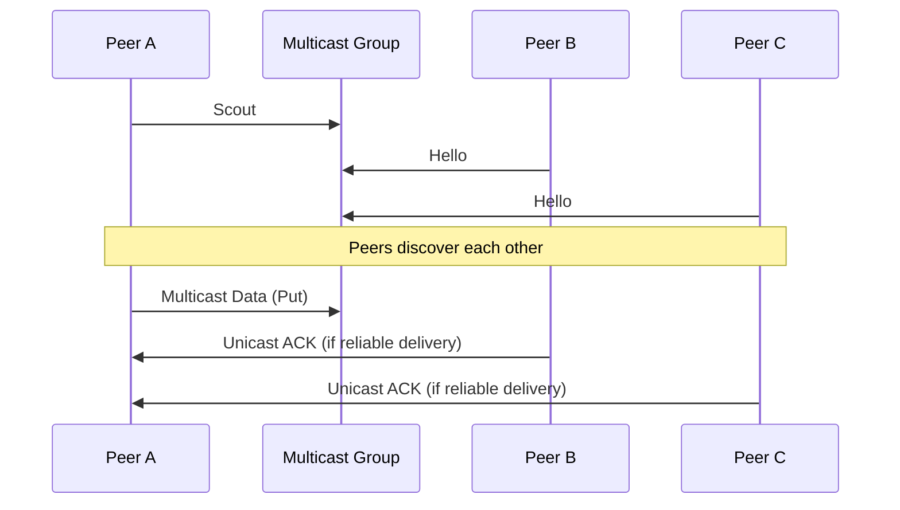

# Zenoh Protocol over Multicast UDP

When Zenoh operates over multicast UDP, it primarily uses this for peer discovery and scalable data distribution. The protocol adapts to accommodate the characteristics of multicast communication.

## 1. Multicast Message Structure

The general structure of a Zenoh multicast message remains similar to unicast:

```
[UDP Header] [Zenoh Header] [Zenoh Body]
```

However, there are some key differences in how messages are structured and used.

## 2. Scout Messages

Scout messages are crucial for peer discovery in Zenoh multicast. They are sent to a well-known multicast address.

### 2.1 Scout Message Format

```
 0                   1                   2                   3
 0 1 2 3 4 5 6 7 8 9 0 1 2 3 4 5 6 7 8 9 0 1 2 3 4 5 6 7 8 9 0 1
+-+-+-+-+-+-+-+-+-+-+-+-+-+-+-+-+-+-+-+-+-+-+-+-+-+-+-+-+-+-+-+-+
|0 1 1 1 1|W|0 0|    what        |           options...          |
+-+-+-+-+-+-+-+-+-+-+-+-+-+-+-+-+-+-+-+-+-+-+-+-+-+-+-+-+-+-+-+-+
|                             zid...                             |
+-+-+-+-+-+-+-+-+-+-+-+-+-+-+-+-+-+-+-+-+-+-+-+-+-+-+-+-+-+-+-+-+
|                      (optional fields)                         |
+-+-+-+-+-+-+-+-+-+-+-+-+-+-+-+-+-+-+-+-+-+-+-+-+-+-+-+-+-+-+-+-+
```

- MSG_ID: 01111 (Scout)
- W: Flag indicating whether it's a scout (0) or a hello message (1)
- what: The type of entity sending the scout (e.g., peer, client)
- zid: The Zenoh ID of the sender

## 3. Hello Messages

Hello messages are responses to Scout messages, also sent via multicast to allow all peers to learn about each other.

### 3.1 Hello Message Format

```
 0                   1                   2                   3
 0 1 2 3 4 5 6 7 8 9 0 1 2 3 4 5 6 7 8 9 0 1 2 3 4 5 6 7 8 9 0 1
+-+-+-+-+-+-+-+-+-+-+-+-+-+-+-+-+-+-+-+-+-+-+-+-+-+-+-+-+-+-+-+-+
|0 1 1 1 1|1|0 0|    whatami     |           options...          |
+-+-+-+-+-+-+-+-+-+-+-+-+-+-+-+-+-+-+-+-+-+-+-+-+-+-+-+-+-+-+-+-+
|                             zid...                             |
+-+-+-+-+-+-+-+-+-+-+-+-+-+-+-+-+-+-+-+-+-+-+-+-+-+-+-+-+-+-+-+-+
|                       locators...                              |
+-+-+-+-+-+-+-+-+-+-+-+-+-+-+-+-+-+-+-+-+-+-+-+-+-+-+-+-+-+-+-+-+
```

- MSG_ID: 01111 (same as Scout, but with W flag set to 1)
- whatami: The type of entity sending the hello
- zid: The Zenoh ID of the sender
- locators: Network locations where the peer can be reached

## 4. Data Distribution

For data distribution, Zenoh can use multicast to efficiently send data to multiple subscribers simultaneously.

### 4.1 Multicast Data Message

```
 0                   1                   2                   3
 0 1 2 3 4 5 6 7 8 9 0 1 2 3 4 5 6 7 8 9 0 1 2 3 4 5 6 7 8 9 0 1
+-+-+-+-+-+-+-+-+-+-+-+-+-+-+-+-+-+-+-+-+-+-+-+-+-+-+-+-+-+-+-+-+
|0 0 0 0 0|0 0 0|    options    |           wire_expr...         |
+-+-+-+-+-+-+-+-+-+-+-+-+-+-+-+-+-+-+-+-+-+-+-+-+-+-+-+-+-+-+-+-+
|                         timestamp...                           |
+-+-+-+-+-+-+-+-+-+-+-+-+-+-+-+-+-+-+-+-+-+-+-+-+-+-+-+-+-+-+-+-+
|                         encoding...                            |
+-+-+-+-+-+-+-+-+-+-+-+-+-+-+-+-+-+-+-+-+-+-+-+-+-+-+-+-+-+-+-+-+
|                         payload...                             |
+-+-+-+-+-+-+-+-+-+-+-+-+-+-+-+-+-+-+-+-+-+-+-+-+-+-+-+-+-+-+-+-+
```

This is similar to the unicast Put message, but it's sent to a multicast address.

## 5. Sequence Diagram for Multicast Communication

Here's a sequence diagram showing peer discovery and data distribution using multicast:



1. Peer A sends a Scout message to the multicast group.
2. Peers B and C respond with Hello messages, also sent to the multicast group.
3. All peers learn about each other from the Hello messages.
4. Peer A can then send data to the multicast group, which is received by both B and C.
5. If reliable delivery is required, B and C may send unicast ACKs back to A.

## 6. Key Considerations for Multicast UDP

1. **Efficiency**: Multicast allows for efficient one-to-many communication, reducing network load.
2. **Discovery**: Multicast is particularly useful for peer discovery in local networks.
3. **Reliability**: UDP is inherently unreliable, so Zenoh may implement additional reliability mechanisms for critical data.
4. **Scalability**: Multicast helps Zenoh scale to many subscribers without increasing sender load.
5. **Network Support**: Not all networks support multicast, so Zenoh must fall back to unicast when necessary.

This overview provides insight into how Zenoh adapts its protocol for multicast UDP communication, particularly for discovery and efficient data distribution in local networks.
