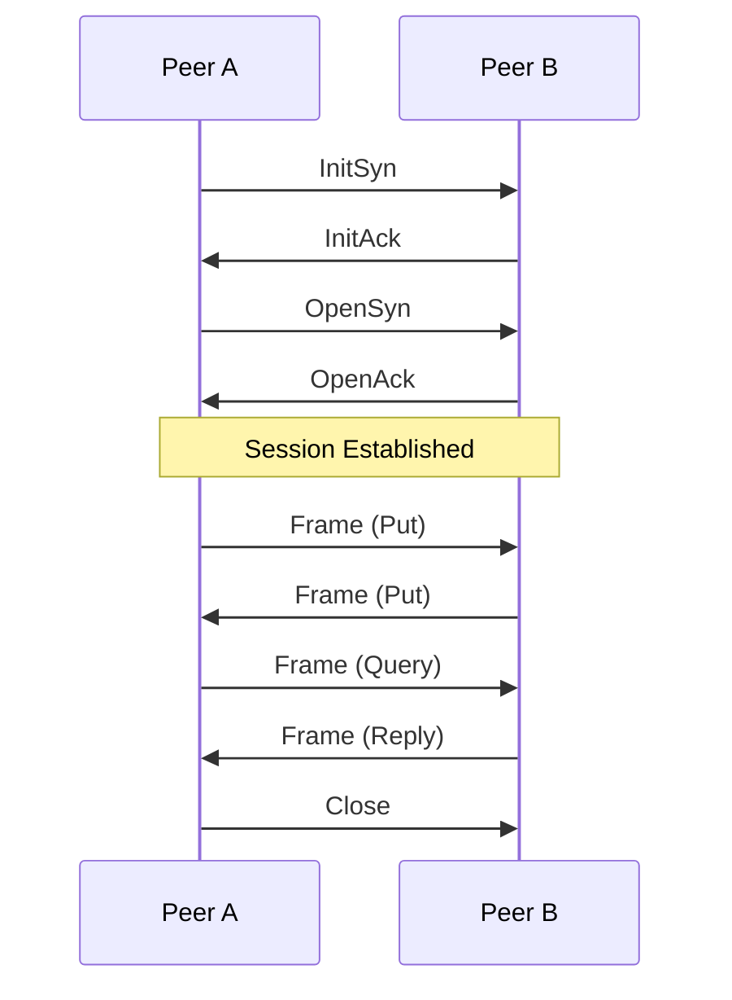

# Zenoh Protocol Byte-Level Documentation

## 1. Message Structure

Zenoh messages generally follow this structure:

```
[Header] [Body]
```

The Header typically includes information about the message type and any flags, while the Body contains the actual payload or specific fields for that message type.

## 2. Common Header Format

Most Zenoh messages start with a header byte:

```
 0 1 2 3 4 5 6 7
+-+-+-+-+-+-+-+-+
|  MSG_ID |FLAGS|
+-+-+-+-+-+-+-+-+
```

- MSG_ID (5 bits): Identifies the message type
- FLAGS (3 bits): Message-specific flags

## 3. Examples of Message Types

### 3.1 InitSyn Message

```
 0                   1                   2                   3
 0 1 2 3 4 5 6 7 8 9 0 1 2 3 4 5 6 7 8 9 0 1 2 3 4 5 6 7 8 9 0 1
+-+-+-+-+-+-+-+-+-+-+-+-+-+-+-+-+-+-+-+-+-+-+-+-+-+-+-+-+-+-+-+-+
|0 0 0 0 1|0 0 0|    version    |    whatami    |                |
+-+-+-+-+-+-+-+-+-+-+-+-+-+-+-+-+-+-+-+-+-+-+-+-+                +
|                                                                |
+                             zid (16 bytes)                     +
|                                                                |
+                                               +-+-+-+-+-+-+-+-+
|                                               |   resolution  |
+-+-+-+-+-+-+-+-+-+-+-+-+-+-+-+-+-+-+-+-+-+-+-+-+-+-+-+-+-+-+-+-+
|            batch_size         |      ... (optional extensions)
+-+-+-+-+-+-+-+-+-+-+-+-+-+-+-+-+
```

- MSG_ID: 00001 (InitSyn)
- version: Protocol version
- whatami: Type of the entity (e.g., peer, client)
- zid: 16-byte Zenoh ID
- resolution: Time resolution
- batch_size: Maximum number of messages in a batch

### 3.2 Frame Message

```
 0                   1                   2                   3
 0 1 2 3 4 5 6 7 8 9 0 1 2 3 4 5 6 7 8 9 0 1 2 3 4 5 6 7 8 9 0 1
+-+-+-+-+-+-+-+-+-+-+-+-+-+-+-+-+-+-+-+-+-+-+-+-+-+-+-+-+-+-+-+-+
|0 0 1 1 0|R|0 0|                    sn                         |
+-+-+-+-+-+-+-+-+-+-+-+-+-+-+-+-+-+-+-+-+-+-+-+-+-+-+-+-+-+-+-+-+
|                         payload...                             |
+-+-+-+-+-+-+-+-+-+-+-+-+-+-+-+-+-+-+-+-+-+-+-+-+-+-+-+-+-+-+-+-+
```

- MSG_ID: 00110 (Frame)
- R: Reliability flag
- sn: Sequence number
- payload: Actual data (can be multiple Network Messages)

### 3.3 Put Message (Network Layer)

```
 0                   1                   2                   3
 0 1 2 3 4 5 6 7 8 9 0 1 2 3 4 5 6 7 8 9 0 1 2 3 4 5 6 7 8 9 0 1
+-+-+-+-+-+-+-+-+-+-+-+-+-+-+-+-+-+-+-+-+-+-+-+-+-+-+-+-+-+-+-+-+
|0 0 0 0 0|0 0 0|    options    |           wire_expr...         |
+-+-+-+-+-+-+-+-+-+-+-+-+-+-+-+-+-+-+-+-+-+-+-+-+-+-+-+-+-+-+-+-+
|                         timestamp...                           |
+-+-+-+-+-+-+-+-+-+-+-+-+-+-+-+-+-+-+-+-+-+-+-+-+-+-+-+-+-+-+-+-+
|                         encoding...                            |
+-+-+-+-+-+-+-+-+-+-+-+-+-+-+-+-+-+-+-+-+-+-+-+-+-+-+-+-+-+-+-+-+
|                         payload...                             |
+-+-+-+-+-+-+-+-+-+-+-+-+-+-+-+-+-+-+-+-+-+-+-+-+-+-+-+-+-+-+-+-+
```

- MSG_ID: 00000 (Put)
- options: Flags for optional fields
- wire_expr: Optimized expression for routing
- timestamp: Optional timestamp
- encoding: Data encoding information
- payload: Actual data

## 4. Sequence Diagram

Here's a simplified sequence diagram showing the establishment of a Zenoh session and data exchange:



1. Peers exchange InitSyn and InitAck to negotiate protocol parameters.
2. OpenSyn and OpenAck establish the session.
3. Once the session is established, peers can exchange data using Frame messages containing Put, Query, Reply, etc.
4. The session is closed with a Close message.

## 5. Key Points

1. **Efficiency**: Zenoh uses compact message formats to reduce overhead.
2. **Flexibility**: The protocol supports various message types for different operations (data sharing, querying, management).
3. **Extensibility**: Many message types support optional extensions for future enhancements.
4. **Reliability**: Sequence numbers and reliability flags ensure ordered and reliable delivery when needed.
5. **Scalability**: The use of wire expressions and efficient routing mechanisms supports large-scale deployments.

This byte-level documentation provides insight into how Zenoh messages are structured at the lowest level. When analyzing Zenoh traffic, you can use this information to interpret the raw bytes and understand the flow of communication between peers.
