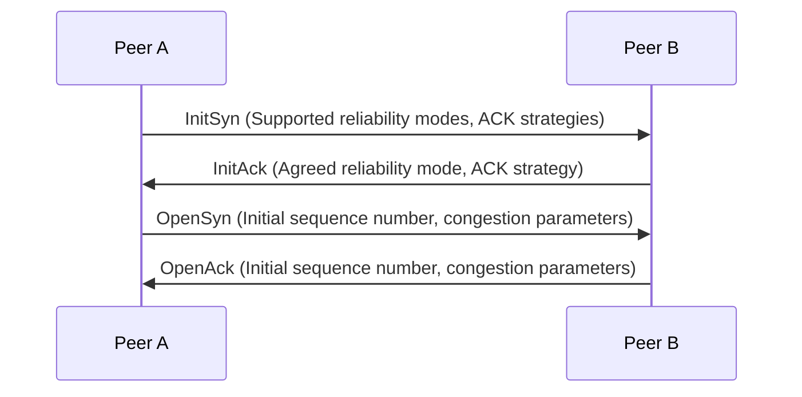
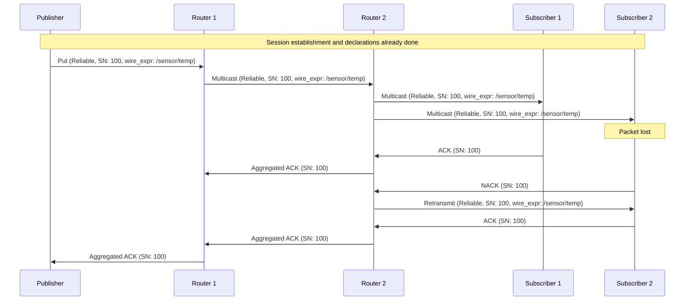

# Interactions of Zenoh Reliability Mechanisms with Other Protocol Components

The reliability mechanisms in Zenoh are deeply integrated with other parts of the protocol. Let's explore these interactions:

## 1. Interaction with Transport Layer

### 1.1 Session Establishment

- During the InitSyn/InitAck exchange, peers negotiate:
  - Reliability modes supported
  - ACK strategies (e.g., immediate vs. delayed ACKs)
  - Congestion control parameters



### 1.2 Keep-Alive Mechanism

- Reliability mechanisms interact with keep-alive messages to:
  - Detect peer disconnections
  - Maintain NAT bindings in UDP scenarios

## 2. Interaction with Zenoh Layer

### 2.1 Put Operations

- When a Put operation is performed:
  - The reliability mode affects how the data is sent and acknowledged
  - For reliable mode, the operation is considered complete only after acknowledgment

```
 0                   1                   2                   3
 0 1 2 3 4 5 6 7 8 9 0 1 2 3 4 5 6 7 8 9 0 1 2 3 4 5 6 7 8 9 0 1
+-+-+-+-+-+-+-+-+-+-+-+-+-+-+-+-+-+-+-+-+-+-+-+-+-+-+-+-+-+-+-+-+
|0 0 0 0 0|R|0 0|    options    |           wire_expr...         |
+-+-+-+-+-+-+-+-+-+-+-+-+-+-+-+-+-+-+-+-+-+-+-+-+-+-+-+-+-+-+-+-+
|                         payload...                             |
+-+-+-+-+-+-+-+-+-+-+-+-+-+-+-+-+-+-+-+-+-+-+-+-+-+-+-+-+-+-+-+-+
```

The 'R' bit in the header indicates if reliable delivery is required.

### 2.2 Query/Reply Interactions

- For queries requiring reliable responses:
  - The reliability mechanisms ensure all replies are received
  - Missing replies can be re-requested using NACKs

## 3. Interaction with Network Layer

### 3.1 Routing and Reliability

- The wire_expr in network messages interacts with reliability:
  - It determines which peers should acknowledge multicast messages
  - Helps in efficient routing of retransmissions

### 3.2 QoS and Reliability

- QoS parameters interact with reliability mechanisms:
  - Prioritization of retransmissions
  - Adjusting congestion control based on QoS requirements

## 4. Interaction with Declaration Mechanisms

### 4.1 Subscriber Declarations

- When a subscriber is declared:
  - The reliability mode affects how missed publications are handled
  - It may trigger historical data retrieval for reliable streams

### 4.2 Publisher Declarations

- Publishers declare their reliability capabilities:
  - Affects how receivers handle the data stream
  - Influences routing decisions for reliability-aware routing

## 5. Scalability Considerations

### 5.1 Multicast and Reliability

- In multicast scenarios:
  - Reliability mechanisms adapt to reduce ACK/NACK implosion
  - Use of designated receivers or hierarchical ACK schemes

### 5.2 Large-Scale Networks

- For large-scale deployments:
  - Reliability mechanisms may use gossip protocols for ACK propagation
  - Adaptive congestion control based on network topology

## 6. Example: Reliable Multicast Publication

Let's look at how these interactions play out in a reliable multicast publication scenario:



In this scenario:
1. The publisher sends a reliable Put operation.
2. Routers use the wire_expr for efficient multicast routing.
3. Subscribers use ACKs and NACKs based on the reliability mode.
4. Routers aggregate ACKs to improve scalability.
5. Retransmission is handled at the nearest point (R2 in this case).

These interactions showcase how Zenoh's reliability mechanisms are tightly integrated with other protocol components, ensuring efficient and reliable communication across various network scenarios.
