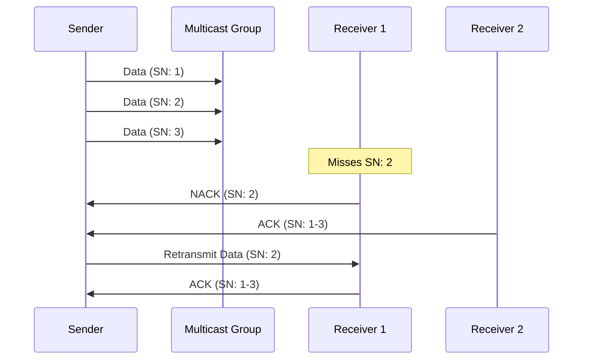

# Zenoh Reliability Mechanisms over UDP

Zenoh implements several mechanisms to ensure reliability when operating over UDP, which is particularly challenging in multicast scenarios. Here's an overview of these mechanisms:

## 1. Sequence Numbers

Every Zenoh message includes a sequence number. This allows recipients to:
- Detect missing messages
- Reorder messages that arrive out of sequence
- Identify and discard duplicate messages

```
 0                   1                   2                   3
 0 1 2 3 4 5 6 7 8 9 0 1 2 3 4 5 6 7 8 9 0 1 2 3 4 5 6 7 8 9 0 1
+-+-+-+-+-+-+-+-+-+-+-+-+-+-+-+-+-+-+-+-+-+-+-+-+-+-+-+-+-+-+-+-+
|   MSG_ID  |R|   |                    sn                        |
+-+-+-+-+-+-+-+-+-+-+-+-+-+-+-+-+-+-+-+-+-+-+-+-+-+-+-+-+-+-+-+-+
```

The 'R' bit indicates whether the message requires reliable delivery.

## 2. Acknowledgments (ACKs)

For reliable delivery, Zenoh uses positive acknowledgments:
- Recipients send ACKs for received messages
- In multicast scenarios, to avoid ACK implosion, Zenoh may use:
  - ACK aggregation: Multiple ACKs combined into one message
  - Probabilistic ACKs: Only a subset of recipients send ACKs

```
 0                   1                   2                   3
 0 1 2 3 4 5 6 7 8 9 0 1 2 3 4 5 6 7 8 9 0 1 2 3 4 5 6 7 8 9 0 1
+-+-+-+-+-+-+-+-+-+-+-+-+-+-+-+-+-+-+-+-+-+-+-+-+-+-+-+-+-+-+-+-+
|   MSG_ID  |0|   |                 mask                         |
+-+-+-+-+-+-+-+-+-+-+-+-+-+-+-+-+-+-+-+-+-+-+-+-+-+-+-+-+-+-+-+-+
|                          sn_base                               |
+-+-+-+-+-+-+-+-+-+-+-+-+-+-+-+-+-+-+-+-+-+-+-+-+-+-+-+-+-+-+-+-+
```

The 'mask' field indicates which messages in a window starting from 'sn_base' have been received.

## 3. Negative Acknowledgments (NACKs)

In addition to ACKs, Zenoh uses NACKs to quickly request retransmission of missing messages:
- Recipients send NACKs when they detect gaps in the sequence numbers
- This is particularly useful in multicast scenarios, allowing for efficient loss recovery

```
 0                   1                   2                   3
 0 1 2 3 4 5 6 7 8 9 0 1 2 3 4 5 6 7 8 9 0 1 2 3 4 5 6 7 8 9 0 1
+-+-+-+-+-+-+-+-+-+-+-+-+-+-+-+-+-+-+-+-+-+-+-+-+-+-+-+-+-+-+-+-+
|   MSG_ID  |1|   |                 mask                         |
+-+-+-+-+-+-+-+-+-+-+-+-+-+-+-+-+-+-+-+-+-+-+-+-+-+-+-+-+-+-+-+-+
|                          sn_base                               |
+-+-+-+-+-+-+-+-+-+-+-+-+-+-+-+-+-+-+-+-+-+-+-+-+-+-+-+-+-+-+-+-+
```

The format is similar to ACKs, but with a flag indicating it's a NACK.

## 4. Retransmission

When a sender doesn't receive an ACK or receives a NACK:
- It retransmits the missing messages
- In multicast, retransmissions can be sent to the multicast group, benefiting multiple recipients

## 5. Reliability Modes

Zenoh offers different reliability modes to suit various needs:
- Best-effort: No guarantees, suitable for non-critical, high-frequency data
- Reliable: Ensures delivery, but may introduce latency
- TOSS (Time-Ordered Reliable Streaming): Ensures in-order delivery within a time bound

## 6. Congestion Control

To prevent network congestion:
- Zenoh implements rate control mechanisms
- It adjusts transmission rates based on network conditions and received ACKs/NACKs

## 7. Fragment and Reassembly

For messages larger than the MTU:
- Zenoh fragments the message into smaller parts
- Each fragment carries a sequence number and flags indicating its position
- Recipients reassemble the fragments to reconstruct the original message

```
 0                   1                   2                   3
 0 1 2 3 4 5 6 7 8 9 0 1 2 3 4 5 6 7 8 9 0 1 2 3 4 5 6 7 8 9 0 1
+-+-+-+-+-+-+-+-+-+-+-+-+-+-+-+-+-+-+-+-+-+-+-+-+-+-+-+-+-+-+-+-+
|   MSG_ID  |R|F|L|              sn                              |
+-+-+-+-+-+-+-+-+-+-+-+-+-+-+-+-+-+-+-+-+-+-+-+-+-+-+-+-+-+-+-+-+
|                          payload...                            |
+-+-+-+-+-+-+-+-+-+-+-+-+-+-+-+-+-+-+-+-+-+-+-+-+-+-+-+-+-+-+-+-+
```

'F' and 'L' flags indicate the first and last fragments respectively.

## 8. Multicast-Specific Considerations

In multicast scenarios:
- Zenoh may use a designated receiver to send ACKs, reducing ACK traffic
- It may implement a two-phase protocol:
  1. Multicast data to the group
  2. Collect ACKs/NACKs and perform unicast retransmissions as needed

## Sequence Diagram: Reliable Multicast Transmission



This diagram shows how Zenoh handles packet loss in a multicast scenario, using NACKs for quick recovery and ACKs for confirmation.

By implementing these mechanisms, Zenoh provides reliable communication over UDP, even in challenging multicast environments, while striving to maintain efficiency and low latency.
